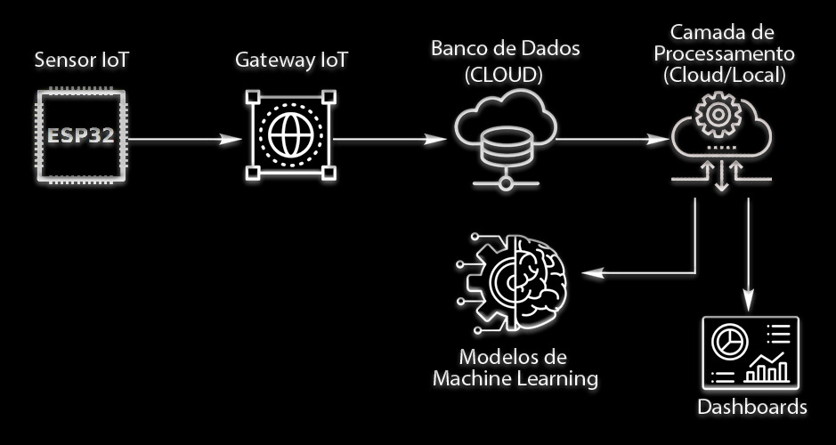
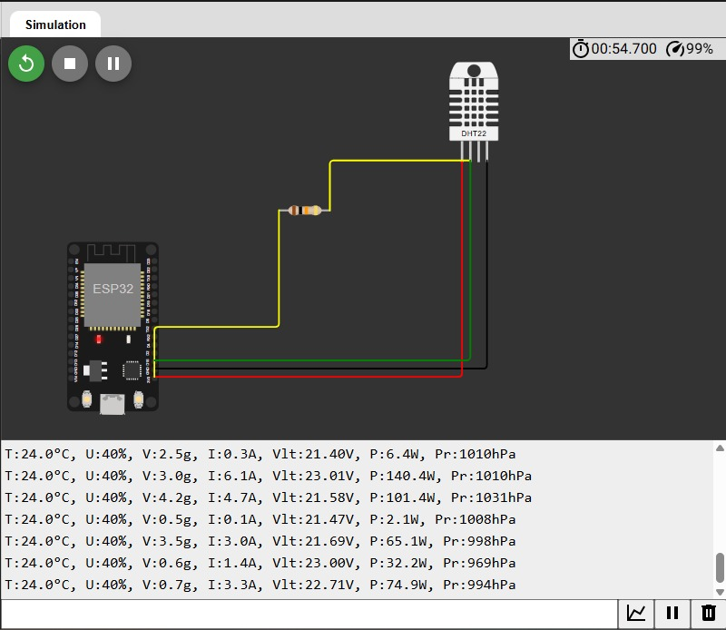
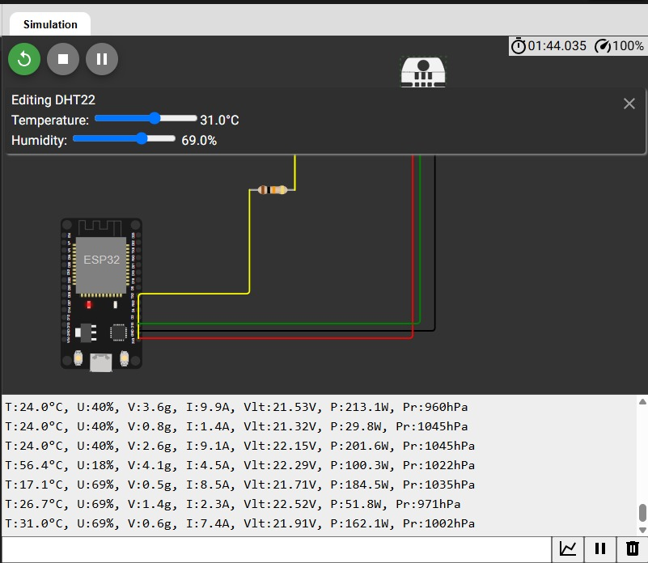
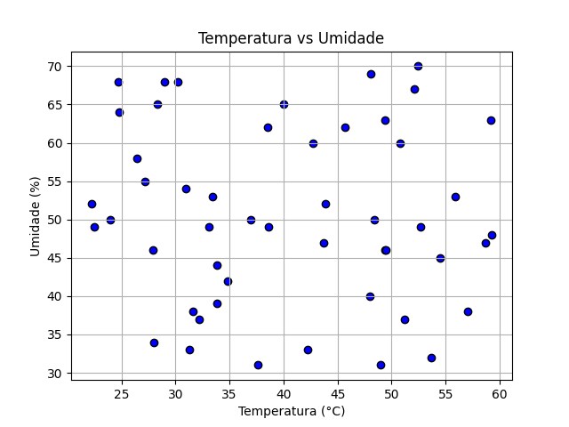
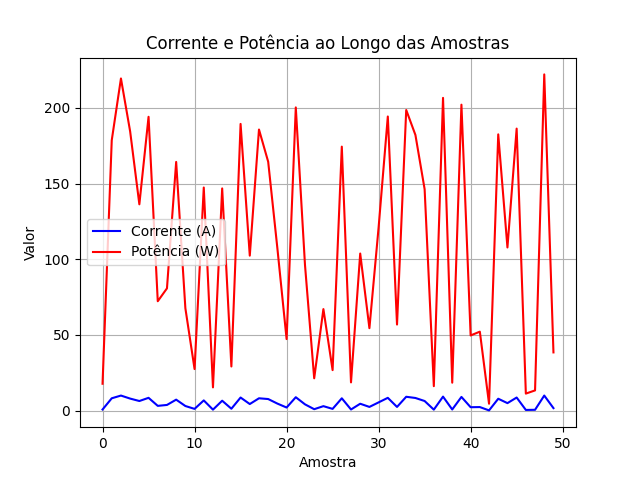
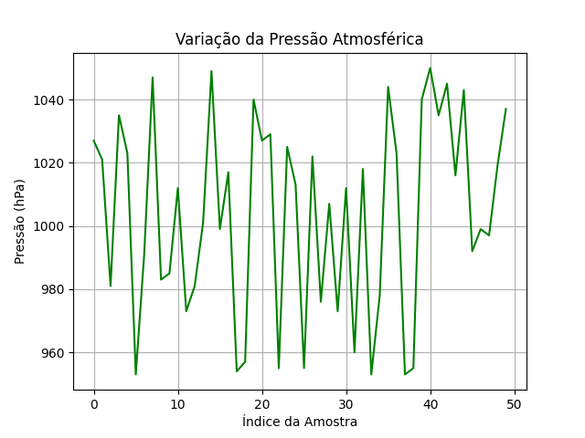

# FIAP - Faculdade de Informática e Administração Paulista 


## Implementação Prática - Fase 3 - SPRINT1

<p align="center">
<a href= "https://www.fiap.com.br/"></a>
</p>

<br>

# CHALLENGE REPLY

## Integrantes: 
- Carlos Daniel Silveira Do Nascimento - RM88439
- Mauricio Jose Ferlin Tonnera - RM565469
- Rodrigo Portugal Santos - RM564773

## Professores:
### Tutor(a) 
- Leonardo Ruiz Orabona
### Coordenador(a)
- André Godoi


## Objetivos

A interrupção inesperada em linhas de produção industrial acarreta perdas financeiras e operacionais significativas. Diante desse cenário, propomos uma solução digital abrangente para a prevenção de falhas, com base nos pilares da Inteligência Artificial (IA), Internet das Coisas (IoT) e análise de dados. Nossa proposta visa monitorar os equipamentos em tempo real, identificar padrões preditivos de falhas e fornecer insights acionáveis por meio de dashboards e relatórios automatizados, capacitando a empresa a adotar medidas preventivas eficazes.

## Justificativa do Problema

A proposta do desafio é aplicar os conhecimentos do curso de IA a um problema real, considerando o contexto de empresas que enfrentam interrupções inesperadas em seus processos produtivos, o que gera perdas financeiras e operacionais.

## Descrição da Solução Proposta

A arquitetura da nossa solução será baseada em uma abordagem modular e escalável, utilizando tecnologias que se complementam para garantir a coleta, armazenamento, processamento, análise e visualização dos dados de forma eficiente.

## Definição das Tecnologias

- **Sensor:** ESP32
- **Linguagens de Programação:** Python, R, SQL, C/C++
- **Bibliotecas de IA:** TensorFlow, Keras, Pandas
- **Serviços de Nuvem:** AWS
- **Banco de Dados:** AWS S3, PostgreSQL

## Coleta de Dados

- **Fonte dos Dados**:  
  Os dados serão coletados em tempo real a partir de diversos sensores instalados nos equipamentos da linha de produção. Esses sensores podem monitorar variáveis como:  
  - Temperatura  
  - Vibração  
  - Nível de ruído  
  - Consumo de energia  
  - Pressão  
  - Velocidade de rotação  
  - Outras métricas específicas de cada equipamento.

- **Tecnologia de Coleta (Simulação Inicial / Planejamento Real)**:  
  - **Simulação Inicial**: Para a fase inicial do projeto e fins de demonstração, os dados poderão ser simulados utilizando Python. Serão gerados datasets sintéticos que imitam o comportamento de sensores reais, incluindo padrões normais e anomalias que simulam falhas.  
  - **Planejamento Real**: Em um cenário de implementação real, utilizaríamos microcontroladores com conectividade Wi-Fi, como o ESP32. Esses dispositivos são capazes de ler os dados dos sensores e transmiti-los de forma contínua para um gateway IoT.

- **Gateway IoT**:  
  Um gateway IoT atuará como intermediário entre os sensores e o banco de dados. Ele será responsável por:  
  - Receber os dados brutos dos sensores  
  - Realizar um pré-processamento básico (filtragem, agregação inicial)  
  - Garantir a comunicação segura e eficiente dos dados para a camada de armazenamento

## Armazenamento de Dados

- **Banco de dados**:  
  Optamos por um banco de dados em nuvem, AWS S3 e PostgreSQL.

- **Justificativa**:  
  - **Escalabilidade**: A nuvem oferece alta escalabilidade, permitindo aumentar ou diminuir a capacidade de armazenamento conforme o volume de dados gerado pela linha de produção evolui.  
  - **Disponibilidade e Confiabilidade**: Os serviços de banco de dados em nuvem garantem alta disponibilidade e mecanismos de backup e recuperação robustos, minimizando o risco de perda de dados.  
  - **Gerenciamento**: A gestão do banco de dados é simplificada, com tarefas como patching, backup e manutenção sendo parcialmente ou totalmente gerenciadas pelo provedor de nuvem.  
  - **Custo**: Para a fase inicial, um banco de dados de menor porte na nuvem pode ser mais viável financeiramente do que a implementação e manutenção de uma infraestrutura local robusta.

## Camada de Processamento

- **Tecnologias de Processamento**:  
  A camada de processamento será responsável por preparar os dados para análise e modelagem de IA. Utilizaremos principalmente Python com as bibliotecas Pandas para manipulação e limpeza dos dados e R para análises estatísticas exploratórias e validação de insights.

- **Local de Processamento**:  
  O processamento poderá ocorrer tanto em instâncias de computação na nuvem (AWS EC2 ou Google Compute Engine) quanto em um ambiente local, dependendo da sensibilidade dos dados, requisitos de latência e custos. Para a fase inicial, um ambiente local com poder de processamento adequado será suficiente. Em um cenário de produção com grande volume de dados, a escalabilidade da nuvem se torna crucial.

- **Pipeline de Dados**:  
  O pipeline de dados consistirá nas seguintes etapas:  
  1. **Ingestão**: Coleta dos dados do banco de dados  
  2. **Limpeza e Pré-processamento**: Tratamento de dados faltantes, remoção de ruídos, normalização e transformação das variáveis  
  3. **Engenharia de Features**: Criação de novas variáveis relevantes para a modelagem preditiva, como médias móveis, taxas de variação e desvios  
  4. **Análise Exploratória (R)**: Utilização de R para identificar padrões iniciais, correlações e tendências nos dados, auxiliando na seleção de features e na compreensão do comportamento das falhas

## Modelos de Machine Learning

- **Tecnologias de IA**:  
  Utilizaremos bibliotecas de Machine Learning como Scikit-learn para modelos mais tradicionais (Regressão Logística, Árvores de Decisão, Random Forest, Support Vector Machines) e Keras (com backend TensorFlow) para modelos de Deep Learning, especialmente para análise de séries temporais complexas e padrões sutis.

- **Tipos de Modelos**:  
  - **Classificação**: Para prever a probabilidade de ocorrência de uma falha em um determinado horizonte de tempo  
  - **Regressão**: Para prever o tempo restante até a falha (Remaining Useful Life - RUL)  
  - **Detecção de Anomalias**: Para identificar comportamentos incomuns nos dados dos sensores que podem indicar o início de uma falha

- **Integração**:  
  Os modelos de IA serão treinados utilizando os dados históricos processados e integrados ao pipeline de dados. A inferência (previsão) será realizada em tempo real com os novos dados chegando dos sensores.

## Dashboards e Relatórios Automatizados

- **Tecnologias de Visualização**:  
  Utilizaremos ferramentas de visualização como Python (Matplotlib, Seaborn, Plotly) e plataformas de Business Intelligence (BI) como Tableau ou Power BI para criar dashboards interativos e relatórios automatizados.

- **Conteúdo**:  
  Os dashboards e relatórios fornecerão:  
  - Monitoramento em tempo real das métricas dos equipamentos  
  - Indicadores de saúde dos equipamentos (health scores)  
  - Alertas visuais de potenciais falhas ou anomalias  
  - Previsões de falhas e o tempo estimado até a ocorrência  
  - Recomendações de ações preventivas (manutenção preditiva)  
  - Análise de tendências de falhas ao longo do tempo  
  - Relatórios sumarizados para a gerência com insights e recomendações
 
  - ## Esboço da Arquitetura da Solução




## Divisão de Tarefas 

**Simulação  e recebimento dos dados:** Carlos, Mauricio.

**Armazenamento + tratamento e pré-processamento dos dados:** Rodrigo, Mauricio.

**Treinamento e integração do modelo de IA:** Carlos, Rodrigo.

**Criação do dashboard:**  Rodrigo, Mauricio.

**README & Apresentação final:** Todos.

## Implementação Prática - Fase 4 - SPRINT2

### Simulação no Wokwi

Para validar a proposta da arquitetura em um ambiente simulado, foi utilizado o Wokwi, uma plataforma de simulação de microcontroladores. O circuito simulado incluiu:

- **ESP32 DevKit V1**
- **Sensor DHT22** para leitura de temperatura e umidade
- Simulação adicional via código de:
  - Vibração (g)
  - Corrente elétrica (A)
  - Tensão (V)
  - Potência (W)
  - Pressão atmosférica (hPa)

A leitura dos dados foi feita via porta serial, com os seguintes exemplos de saída:

```
T:25.4°C, U:56%, V:1.8g, I:3.5A, Vlt:220.40V, P:771.4W, Pr:1002hPa
```

> **Link para a simulação no Wokwi**: [clique aqui](https://wokwi.com/projects/433598201475154945)

### Justificativa dos Sensores Utilizados

A escolha dos sensores e variáveis simuladas no código foi baseada na relevância para monitoramento preditivo em ambientes industriais:

- **Temperatura e Umidade (DHT22):** essenciais para controle ambiental de processos industriais e prevenção de superaquecimento. O DHT22 é preciso, barato e fácil de integrar com o ESP32.

- **Vibração (simulada):** representa um dos principais sinais de falha mecânica em motores e rolamentos. Sua análise permite detectar anomalias precoces e evitar quebras.

- **Corrente (A) e Tensão (V):** utilizadas para calcular a potência elétrica consumida. Essas variáveis permitem monitorar sobrecargas, eficiência energética e desgaste de componentes.

- **Potência (W):** derivada direta de corrente e tensão. Ajuda a identificar comportamentos fora do padrão e prever falhas elétricas.

- **Pressão Atmosférica (simulada):** relevante para processos pneumáticos e ambientes pressurizados. Variações anormais podem indicar vazamentos ou falhas em vedação.

Essas variáveis simuladas refletem indicadores-chave em ambientes industriais e permitem demonstrar, mesmo em simulação, a viabilidade de um sistema de monitoramento inteligente.

### 🔧 Código comentado (sketch.ino)

```cpp
#include "DHTesp.h"  // Biblioteca **DHTesp**, otimizada para ESP32/ESP8266 ao lidar com sensores DHT‑11/22 :contentReference[oaicite:1]{index=1}

#define DHT_PIN 15        // Define o pino **GPIO 15** como conexão do sensor DHT22
DHTesp dht;               // Instância `dht` para gerenciar a comunicação e leitura

void setup() {
  Serial.begin(115200);   // Inicializa a porta serial a 115200 bps
  delay(1000);            // Pequena pausa para garantir a estabilidade da conexão
  dht.setup(DHT_PIN, DHTesp::DHT22);  
  // Configura o sensor DHT22 no pino indicado (DHTesp lida automaticamente com os timings) :contentReference[oaicite:2]{index=2}

  Serial.println("Iniciando simulação DHT22 no GPIO15...");
}

void loop() {
  TempAndHumidity th = dht.getTempAndHumidity();  
  // Lê temperatura e umidade em uma única chamada

  float temp = isnan(th.temperature)
               ? random(200, 350) / 10.0  // Se falhar (NaN), gera valor aleatório entre 20.0–35.0 °C
               : th.temperature;

  int umid = isnan(th.humidity)
             ? random(30, 70)           // Se falhar, gera umidade aleatória de 30–69 %
             : int(th.humidity);

  // Simula outros sensores para criar um cenário IoT completo:
  float vibracao = random(0, 51) / 10.0;         // 0.0 – 5.0 g
  float corrente = random(0, 101) / 10.0;        // 0.0 – 10.0 A
  float tensao   = random(2100, 2310) / 100.0;   // 21.00 – 23.10 V
  float potencia = corrente * tensao;            // Potência (W)
  int   pressao  = random(950, 1051);           // 950 – 1050 hPa

  // Envia todos os dados formatados no Serial Monitor:
  Serial.printf(
    "T:%.1f°C, U:%d%%, V:%.1fg, I:%.1fA, Vlt:%.2fV, P:%.1fW, Pr:%dhPa\n",
    temp, umid, vibracao, corrente, tensao, potencia, pressao
  );

  delay(3000);  // Espera 3 segundos até a próxima leitura
}
```

### Exemplos do circuito em funcionamento e saída do serial




### Exportação e Análise de Dados

Os dados gerados pela simulação foram copiados da serial e salvos em um arquivo `dados_simulados.csv`. Em seguida, foi criado um script em Python para geração automática de gráficos com base nesse arquivo.

### Gráficos Gerados

Três gráficos principais foram produzidos com a biblioteca `matplotlib`:

1. **Temperatura vs Umidade**
   - Representa a correlação entre as duas variáveis ambientais.


2. **Corrente e Potência ao longo das amostras**
   - Útil para observar picos de consumo e variações de carga.


3. **Variação da Pressão Atmosférica**
   - Pode indicar mudanças ambientais ou falhas em sistemas pneumáticos.


Os gráficos são salvos automaticamente em formato PNG após a execução do script. Exemplo de execução:

python gerar_graficos.py
```
> Os arquivos são gerados como:
> - `grafico_temperatura_umidade.png`
> - `grafico_potencia_corrente.png`
> - `grafico_pressao.png`
```

## Licença

<p xmlns:cc="http://creativecommons.org/ns#" xmlns:dct="http://purl.org/dc/terms/"><a property="dct:title" rel="cc:attributionURL" href="https://github.com/agodoi/template">MODELO GIT FIAP</a> por <a rel="cc:attributionURL dct:creator" property="cc:attributionName" href="https://fiap.com.br">Fiap</a> está licenciado sobre <a href="http://creativecommons.org/licenses/by/4.0/?ref=chooser-v1" target="_blank" rel="license noopener noreferrer" style="display:inline-block;">Attribution 4.0 International</a>.</p>
